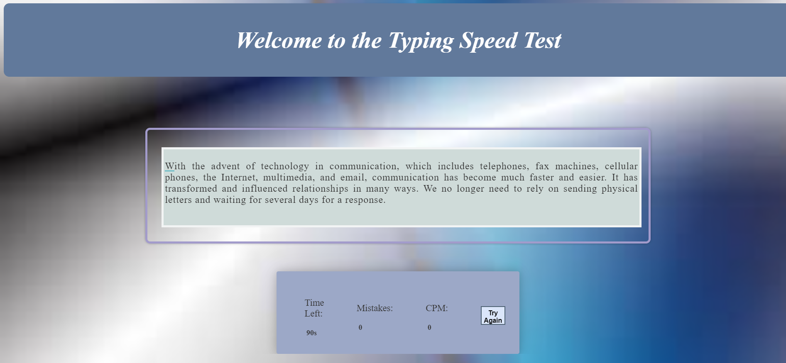

# Typing-speed-Test

This project is a simple Typing Speed Test web application. It allows users to test their typing speed by typing out a paragraph. The application records the number of mistakes made, characters per minute (CPM), and provides a timer to keep track of the time left.

## Project Structure

The project consists of the following files:

- `index.html`: The main HTML file that defines the structure of the web page.
- `styles.css`: The CSS file for styling the web page.
- `paragraphs.js`: JavaScript file containing an array of paragraphs for typing practice.
- `main.js`: The main JavaScript file that handles the typing speed test logic.

## Snap

## Demo
Check your [Typing Speed](https://amar-lahlouh.github.io/Typing-speed-Test/)

## Contributing
Feel free to Contribute by creating a Pull Request or an Issue.

### Thanks
